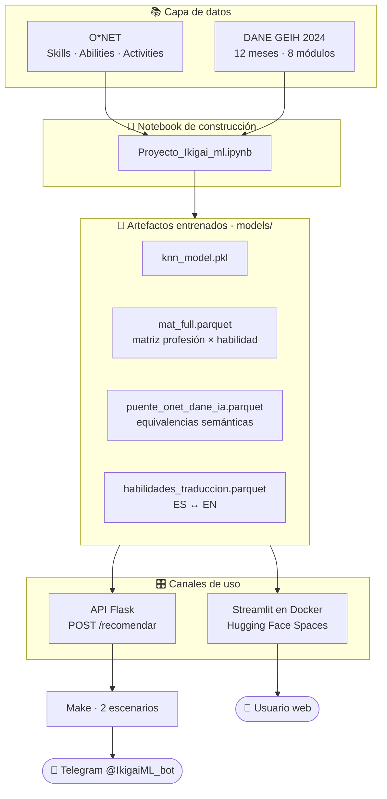

# 🧭 Ikigai IA — Orientador Vocacional Inteligente


> Sistema de recomendación que cruza el **estándar internacional de ocupaciones (O\*NET)** con la **realidad laboral colombiana (GEIH · DANE 2024)** para responder una pregunta concreta: *dadas mis habilidades, ¿qué profesiones se me parecen y qué tan presentes están en el mercado de mi país?*

**[🚀 Probar la app](https://huggingface.co/spaces/jennifersalazarduke/ikigai-ia)** · **[🤖 Bot de Telegram](https://t.me/IkigaiML_bot)** · **[📊 Galería de las 879 profesiones](https://drive.google.com/drive/folders/1YqmXmySe7V9MBGv-dBesgNmMdrznU9mI?usp=sharing)** · **[📄 Página del proyecto](https://humorous-polyester-33a.notion.site/Proyecto-Ikigai-Encuentra-tu-Prop-sito-Profesional-con-IA-25130d9b1a1180dcbb3dda82ffd7ac21)** · **[🎬 Presentación](https://www.canva.com/design/DAGtnSawH0U/NJgsoV12p8wCuanNwrZ1-Q/view)**

---

## 📑 Tabla de contenidos

- [✨ Qué resuelve](#-qué-resuelve)
- [🎯 Qué hace el sistema](#-qué-hace-el-sistema)
- [🏗️ Arquitectura](#️-arquitectura)
- [🧠 Cómo funciona el recomendador](#-cómo-funciona-el-recomendador)
- [🧰 Stack tecnológico](#-stack-tecnológico)
- [🚀 Correr localmente](#-correr-localmente)
- [🔌 API de recomendación](#-api-de-recomendación)
- [📁 Estructura del proyecto](#-estructura-del-proyecto)
- [📊 Fuentes de datos](#-fuentes-de-datos)
- [⚠️ Limitaciones y roadmap](#️-limitaciones-y-roadmap)
- [🌱 Sobre el Salazar Duke Impact Hub](#-sobre-el-salazar-duke-impact-hub)
- [📜 Licencia](#-licencia)

---

## ✨ Qué resuelve

La orientación vocacional en Colombia suele apoyarse en tests de personalidad o en catálogos de carreras. Dos problemas de fondo:

1. **No parten de habilidades reales**, sino de gustos declarados.
2. **No están conectados al mercado laboral local.** Recomiendan profesiones que en Colombia casi no existen como ocupación formal.

Ikigai IA ataca los dos. Parte de **habilidades concretas** y las compara contra el perfil de habilidades de casi 900 profesiones del estándar O\*NET; después traduce cada resultado a su **ocupación equivalente en Colombia** usando los datos reales de la Gran Encuesta Integrada de Hogares del DANE.

> *"Los dos días más importantes de tu vida son el día en que naces y el día en que descubres por qué."* — Mark Twain

---

## 🎯 Qué hace el sistema

| Función | Detalle |
|---|---|
| 🧬 **ADN de habilidades** | Perfil vectorial de **879 profesiones** construido desde O\*NET (Skills, Abilities, Work Activities, Technology Skills) |
| 🔎 **Recomendación por k-NN** | Convierte tus habilidades en un vector normalizado y devuelve las **5 profesiones más cercanas** |
| 🇨🇴 **Puente O\*NET ↔ DANE** | Un modelo multilingüe de *sentence-transformers* encuentra la ocupación colombiana semánticamente equivalente a cada resultado |
| 🎯 **Afinidad de significado** | Score de similitud semántica entre el título O\*NET y la ocupación DANE — muestra qué tan confiable es la equivalencia |
| 📊 **Presencia en el mercado** | Cuántas veces aparece esa ocupación en la GEIH 2024, como proxy de qué tan común es en Colombia |
| 🗣️ **Entrada en español** | Diccionario de traducción ES→EN de habilidades, con normalización de tildes y mayúsculas |
| 💬 **Canal conversacional** | Bot de Telegram que consume la API Flask a través de dos escenarios de Make |

---

## 🏗️ Arquitectura

El proyecto tiene **dos frentes que comparten el mismo motor de modelos**: una app visual y un canal conversacional.



**Decisiones clave:**

- **El entrenamiento vive en el notebook, no en la app.** Las apps solo cargan artefactos `.pkl` y `.parquet` ya construidos. Arrancan en segundos y no necesitan `torch` ni `sentence-transformers` en producción.
- **El puente O\*NET↔DANE se calcula una sola vez.** La similitud semántica es cara; queda congelada en `puente_onet_dane_ia.parquet` con su `Similarity_Score` visible para el usuario, en lugar de esconder la incertidumbre.
- **La app y la API comparten motor, no código.** Streamlit sirve la experiencia visual; Flask expone el mismo recomendador como JSON para que Make y Telegram lo consuman. Si un canal cae, el otro sigue.
- **Todo se muestra en español.** El modelo trabaja en inglés (O\*NET es una fuente estadounidense), pero la traducción ES→EN ocurre en el borde, antes de vectorizar.

---

## 🧠 Cómo funciona el recomendador

1. **Selección de habilidades.** El usuario elige de una lista en español, construida desde `habilidades_traduccion.parquet`.
2. **Normalización y traducción.** Se pasa a minúsculas, se eliminan tildes (`unicodedata` NFKD) y se mapea cada habilidad a su equivalente en inglés O\*NET.
3. **Vectorización.** Se arma un vector binario sobre las columnas de `mat_full.parquet` (una por habilidad) y se **normaliza dividiendo por la suma** — así un perfil con 3 habilidades y otro con 12 son comparables.
4. **Búsqueda de vecinos.** `knn_model.kneighbors(vector, n_neighbors=5)` devuelve las 5 profesiones O\*NET más cercanas.
5. **Aterrizaje en Colombia.** Para cada profesión se busca su fila en `puente_onet_dane_ia.parquet` y se devuelve nombre DANE, descripción del perfil, afinidad semántica y conteo de apariciones en la GEIH 2024.
6. **Comparativa visual.** La app grafica la presencia relativa de las 5 recomendaciones en el mercado colombiano.

> Si una habilidad no está en el diccionario, se descarta silenciosamente. Si **ninguna** se reconoce, la API responde con un error explícito en vez de devolver recomendaciones vacías.

---

## 🧰 Stack tecnológico

| Capa | Tecnología | Rol |
|---|---|---|
| Modelo de recomendación | **scikit-learn** (k-NN) | Vecinos más cercanos sobre la matriz de habilidades |
| NLP semántico | **sentence-transformers** (multilingüe) | Puente O\*NET ↔ ocupaciones DANE |
| Procesamiento de datos | **pandas · numpy · pyarrow** | ETL de O\*NET y GEIH, artefactos en Parquet |
| Emparejamiento difuso | **thefuzz · python-Levenshtein** | Conciliación de nombres de ocupaciones |
| App web | **Streamlit** | Interfaz del orientador (2 vistas) |
| API | **Flask** | Endpoint `POST /recomendar` para integraciones |
| Empaquetado | **Docker** (`python:3.9-slim`) | Imagen del Space, puerto `8501` |
| Hosting | **Hugging Face Spaces** | Despliegue público de la app |
| Automatización | **Make** + **Telegram Bot API** | Canal conversacional |

---

## 🚀 Correr localmente

**Requisitos:** Python 3.9+ y ~1 GB libre para los artefactos de `models/`.

```bash
git clone https://github.com/SalazarDukeImpactHub/Ikigai-IA-ML.git
cd Ikigai-IA-ML
python -m venv venv
source venv/bin/activate   # Windows: venv\Scripts\activate
```

### Opción A — App Streamlit

```bash
pip install -r "App Hugging Face/requirements.txt"

# La app espera los artefactos en una carpeta 'data/' junto al script
mkdir -p "App Hugging Face/data" && cp models/* "App Hugging Face/data/"

streamlit run "App Hugging Face/streamlit_app (1).py"
# → http://localhost:8501
```

### Opción B — API Flask

```bash
pip install -r "Flask Api/requirements-api.txt"

# api.py busca los artefactos en 'models/' relativo a su propia carpeta
mkdir -p "Flask Api/models" && cp models/* "Flask Api/models/"

python "Flask Api/api.py"
# → http://127.0.0.1:5000
```

### Opción C — Docker (igual que el Space)

```bash
docker build -f "App Hugging Face/Dockerfile (1)" -t ikigai-ia .
docker run -p 8501:8501 ikigai-ia
```

> ⚠️ **Nota sobre rutas:** tanto la app como la API resuelven sus artefactos **relativo a su propio archivo** (`data/` y `models/` respectivamente). Los `.pkl` y `.parquet` del repo viven en `models/` en la raíz, así que hay que copiarlos como se indica arriba. Está en el roadmap unificar esto.

---

## 🔌 API de recomendación

**`POST /recomendar`**

```bash
curl -X POST http://127.0.0.1:5000/recomendar \
  -H "Content-Type: application/json" \
  -d '{"habilidades": ["Programación", "Pensamiento crítico", "Análisis de datos"]}'
```

**Respuesta:**

```json
{
  "recomendaciones": [
    {
      "profesion_onet": "Data Scientists",
      "info_colombia": {
        "nombre_dane": "Analistas de datos",
        "descripcion": "Descripción del perfil ocupacional según la GEIH...",
        "afinidad": 0.87,
        "presencia_dane": 1243
      }
    }
  ]
}
```

| Campo | Significado |
|---|---|
| `profesion_onet` | Título de la profesión en el estándar O\*NET |
| `nombre_dane` | Ocupación equivalente en Colombia, encontrada por similitud semántica |
| `afinidad` | Score 0–1 de qué tan bien coinciden ambos conceptos |
| `presencia_dane` | Nº de registros de esa ocupación en la GEIH 2024 |

La API acepta la lista de habilidades como `string`, lista anidada o diccionario — se aplana antes de procesar, porque los escenarios de Make no siempre entregan la misma forma.

---

## 📁 Estructura del proyecto

| Ruta | Qué contiene |
|---|---|
| `Proyecto_Ikigai_ml.ipynb` | **Notebook maestro** — ETL, construcción del ADN de habilidades, entrenamiento k-NN y puente semántico O\*NET↔DANE |
| `App Hugging Face/` | App Streamlit + `Dockerfile` + `requirements.txt` del Space |
| `Flask Api/` | `api.py` con el endpoint `POST /recomendar` y sus dependencias |
| `Chat Boot Telegram MAKE IA/` | Dos blueprints de Make: *El Recepcionista* (conversación) y *Procesador de Habilidades* (llamada al modelo) |
| `models/` | Artefactos entrenados: `knn_model.pkl`, `mat_full.parquet`, `onet_titles.parquet`, `puente_onet_dane_ia.parquet`, `dane_enriquecido_final_2024.parquet`, `habilidades_traduccion.parquet` |
| `data/onet/` | Fuentes O\*NET: Skills, Abilities, Work Activities, Technology Skills, Task Statements, Occupation Data |
| `data/DANE/` | GEIH 2024 completa — 12 meses × 8 módulos (características generales, fuerza de trabajo, ocupados, no ocupados, ingresos, migración, hogar y vivienda, otras formas de trabajo) |
| `data/jobs/` | Ofertas laborales usadas para estimar demanda |
| `Proyecto_Ikigai_ml.pdf` | Documentación técnica exportada del notebook |

---

## 📊 Fuentes de datos

| Fuente | Origen | Uso |
|---|---|---|
| **O\*NET OnLine** | Departamento de Trabajo de EE.UU. | Perfil de habilidades, capacidades y actividades de ~900 profesiones |
| **GEIH 2024** | DANE — Colombia | Frecuencia real y descripción de ocupaciones en el mercado colombiano |
| **Ofertas laborales** | Dataset de `job_postings` | Señal complementaria de demanda |

Las 879 profesiones con su "ADN" visualizado están en la **[galería de gráficos en Drive](https://drive.google.com/drive/folders/1YqmXmySe7V9MBGv-dBesgNmMdrznU9mI?usp=sharing)**.

---

## ⚠️ Limitaciones y roadmap

| Pendiente | Estado |
|---|---|
| Rutas de artefactos unificadas entre app, API y raíz del repo | Backlog — hoy hay que copiar `models/` a mano |
| Nombres de archivo con espacios y sufijos `(1)` | Backlog — herencia de la descarga desde el Space |
| API Flask desplegada públicamente | Hoy corre local / vía Make; no hay endpoint público |
| El Space entra en modo *sleeping* tras inactividad | Comportamiento normal de Hugging Face — el primer arranque tarda unos segundos |
| Sesgo cultural de O\*NET | El estándar es estadounidense; el puente semántico mitiga pero no elimina la brecha con Colombia |
| Evaluación cuantitativa del recomendador | Backlog — hoy la calidad se valida cualitativamente y con el `Similarity_Score` |
| Datasets pesados versionados en Git | Backlog — migrar a Git LFS o a un dataset de Hugging Face |
| Archivo `LICENSE` en el repo | Pendiente — ver nota en [Licencia](#-licencia) |

---

## 🌱 Sobre el Salazar Duke Impact Hub

Proyecto desarrollado por **Jennifer Salazar Duke** en el marco del **Salazar Duke Impact Hub**, iniciativa dedicada a impulsar proyectos de impacto social a través de la tecnología, la educación y la colaboración comunitaria.

La misión detrás de Ikigai IA es ofrecer orientación vocacional **accesible, inteligente y contextualizada a la realidad del mercado laboral colombiano** — ayudando a las personas a encontrar esa intersección entre lo que aman, en lo que son buenos, lo que el mundo necesita y por lo que pueden ser pagados.

🔗 Otros proyectos del Hub: [Centinela](https://github.com/SalazarDukeImpactHub/centinela) · [CAVALTEC](https://github.com/SalazarDukeImpactHub/cavaltechackathon) · [Musa Harness](https://github.com/SalazarDukeImpactHub/musa-harness) · [Asesor SDIH](https://github.com/SalazarDukeImpactHub/asesor-sdih-bootcamp)

---

## 📜 Licencia

Licencia **MIT** — uso, modificación y distribución libres con atribución.

Los datos de **O\*NET** y del **DANE** conservan sus propias licencias y condiciones de uso originales.

---

Hecho con 💜 en Colombia 🇨🇴
